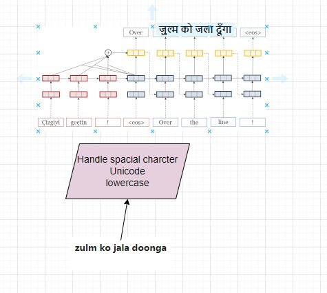

# Nueral_Machine_Translation_Eng_to_Hin
Using Sq2Sq LSTM based model alsg with attension 

## Data Sets:

- Go to this page: http://workshop.colips.org/news2018/dataset.html
- Under the “NEWS2018 DATASET_04” section, you will find Hindi mentioned.
- Press the “request data” link to register &amp; get the download link.
- After downloading the dataset, have a look at the Hindi training set and validation set XML files.

# Model Building

## About LSTM 
LSTM stands for “long short-term memory.” (Quick aside: talk about one of the coolest names in all of machine learning!) Right, so an LSTM network is a special kind of recurrent neural network (RNN). One way to motivate LSTMs is to think about RNNs that suffer from vanishing gradients. Gradients contain information, and over time if gradients vanish important localized information is lost. This is an issue for a famous application of RNNs, understanding language. One odd way of thinking about language / sentences: they contain long-term dependencies. This happens for many reasons, but one reason is because of concrete grammar rules.

- Sq2Sq Encoder and Decoder based Model

  

- Introduce Attention 

